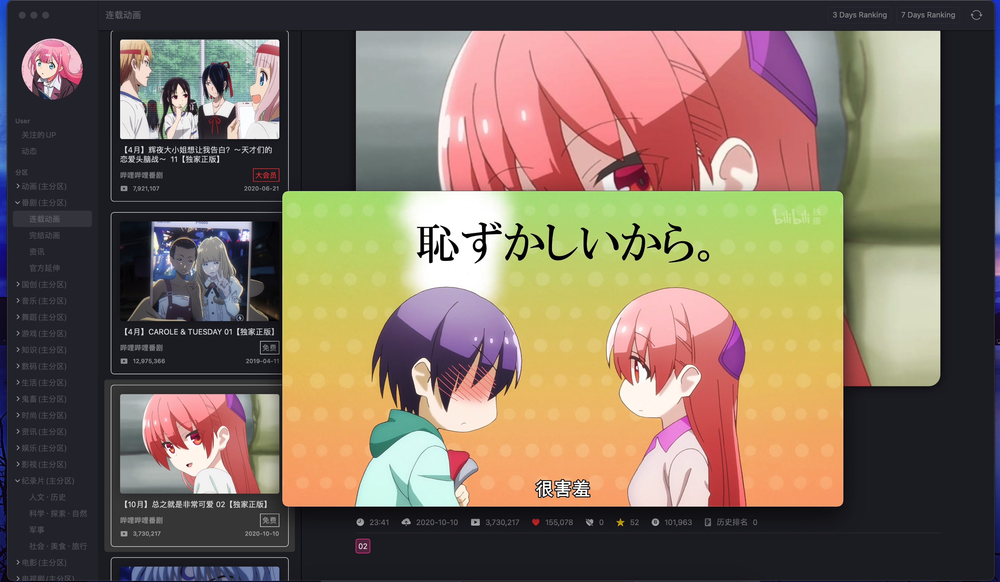
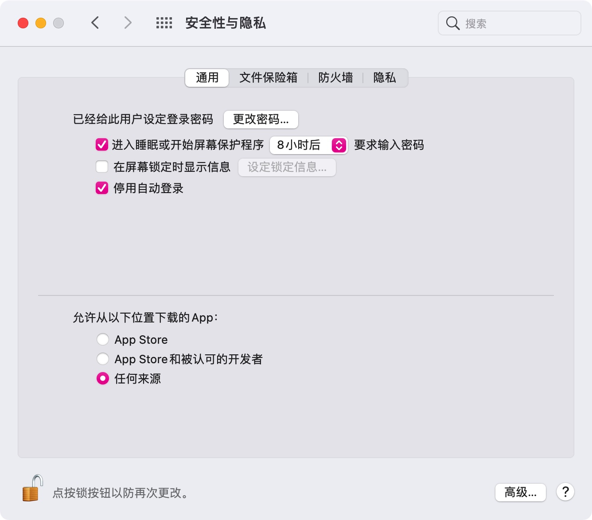

#  Bilibili macOS客户端

这是一个适合佛系B站用户使用的客户端, 没有弹幕, 没有评论, 用它你会感到很孤独.

## Preview

             
Light
 

             
Dark
 

             
播放
 

             
关注的UP
 

## Getting Started

- macOS 11+, 也就是说系统低于`Big Sur`就用不了. 现在macOS 11只有beta版.

- 视频播放使用IINA播放器. 没有写内置播放器, 这个应该普遍都装了吧. 没有安装的去这里: [https://github.com/iina/iina](https://github.com/iina/iina)

- `系统偏好设置`  -> `安全性与隐私`  ->  允许`任何来源`

 
系统设置

- 第一次运行需扫描屏幕的二维码登录. 掏出你的手机, 点开B站移动端, 扫码后手机上点确定. 最后点击屏幕的确认键进行登录确认.

- 登录时, 如果你的IINA播放器本来就是打开状态, 请手动让IINA彻底退出.

  

  Done.

## TODO

- [ ] 搜索
- [ ] 关注的某个UP视频索引翻页, 目前只显示最近的100个
- [ ] 等等等等..., 太多了就不说了

## 已知问题

- 有时图片忽大忽小
- 有时UI抖动
- 等等等等...

## License 授权协议

这个项目 MIT 协议， 请点击 [LICENSE](LICENSE) 了解更多细节。
